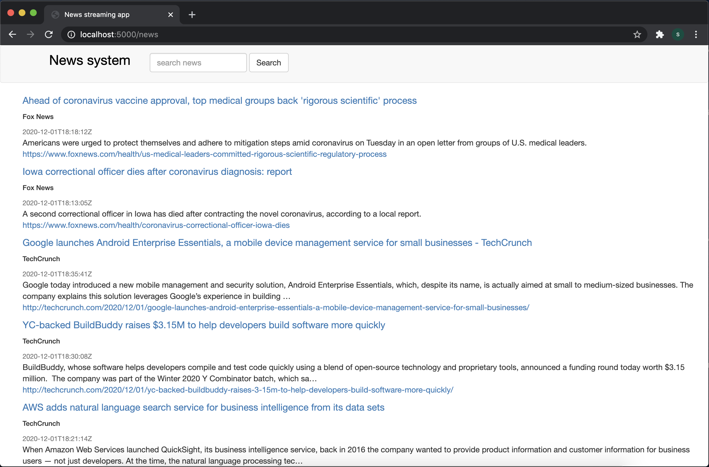
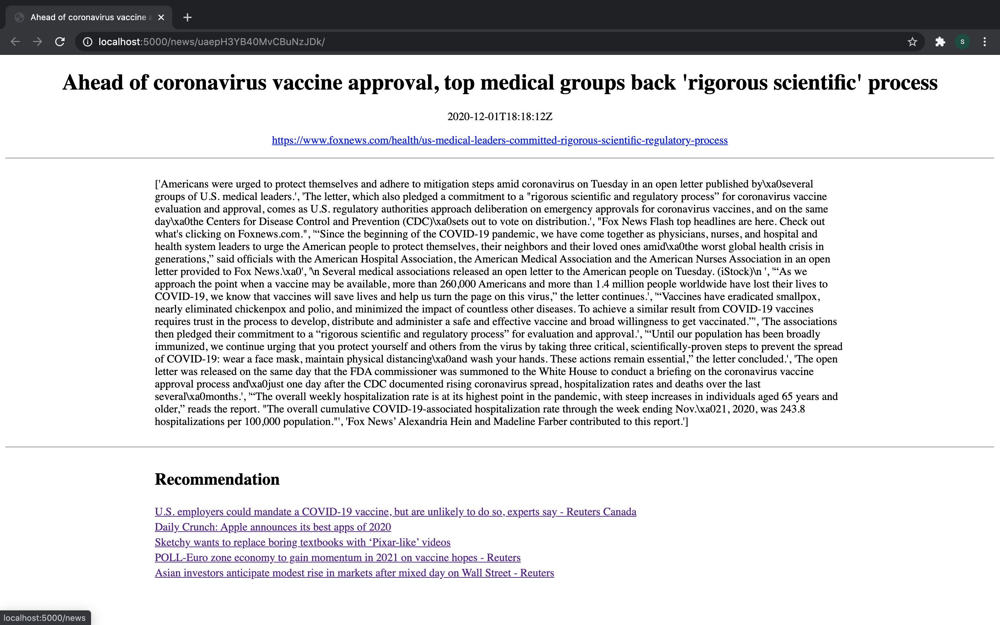
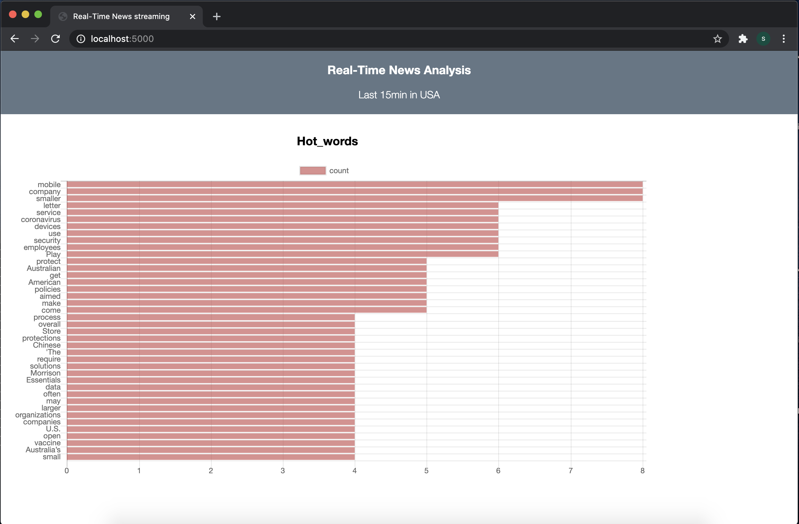

# news_streaming

This is a real-time News screaming application that makes use of Kafka, Spark, Elasticsearch and Redis. \
Main functionalities of this app is as followed: 
* Crawls news data from three sources: Reuters, Fox news and Techcrunch.
* De-duplicated News data using Redis as a lookup database
* Predict the topic of a News article with XGBoost model.
* Analyse the top topics of News in a 15-minutes span using Spark (Map-Reduce, window function).
* Front-end enables news displaying and full-text search.

* Achieve simple recommendation service by calculating the consine similarity between featurized vectors (TF-IDF) of news article. Once the user click an article, recommendation articles will be displayed in bellow.

* The hot words analyzed by Spark are displayed in a real-time dashboard using Chart.js. The dashboard refreshs itself every 5 seconds.

